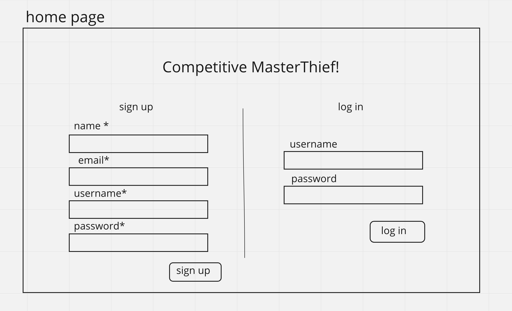
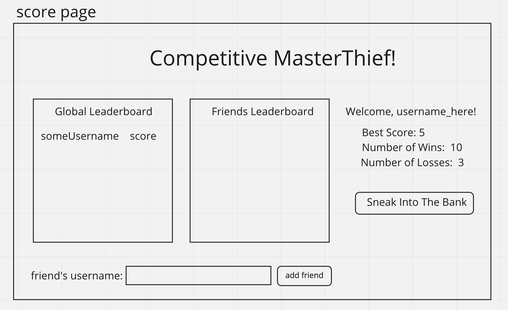
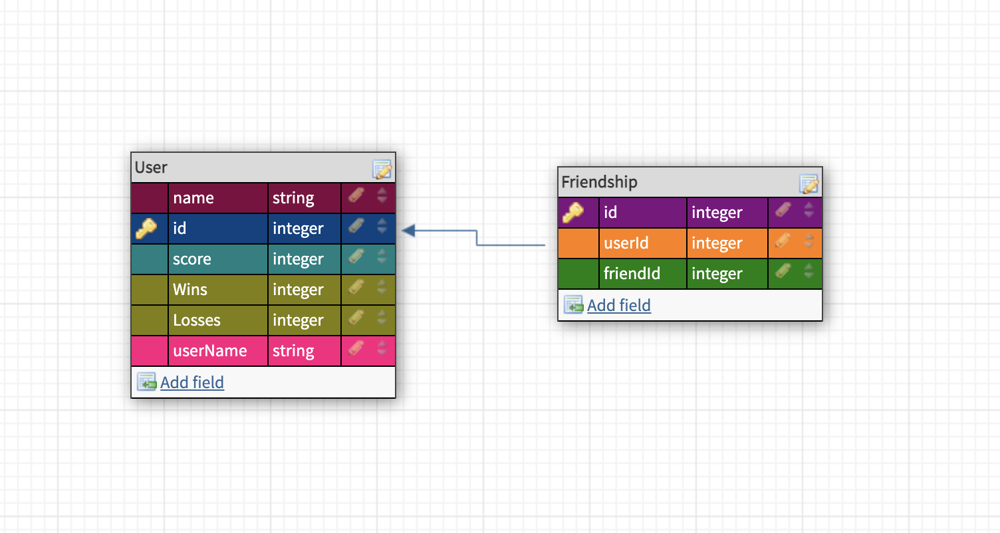

# Competitive-MasterThief
## OverView
### This app is an addon to my project 1 MasterThief game. It will have user profiles, friends, and score tracking(highscore, win/lose, etc.)

User Stories    ->  When a user plays the game they can sign into their own profile. See their stats, and see the stats of their friends. The user should also be able create a new profile and add friends. When they win, their win count will go up and when they beat their high score, their saved score will be changed to that score.

Routes Inventory ->
app.post(‘/login’, getUserByUsername)

app.post(‘/signup’, createUser)

app.post('/user/:id/win/:score', saveScore)

app.get('/user/:id', getMyScore)

app.post('/user/:id/addFriend', addFriend)

app.get('/user/:id/friends', getFriends)

Markdown ->

|User|Friendship|
|:---|:---------|
|id|id|
|score|userId|
|wins|friendId|
|losses|
|userName|

MVP Checklist ->
Sign Up\
Add Scoring and # of Wins Tracker\ 
Show stats when logged in\
show friends scores when logged in\
add friends\

Stretch Goals ->
Global Leaderboard\
Design Changes\
track # of losses

